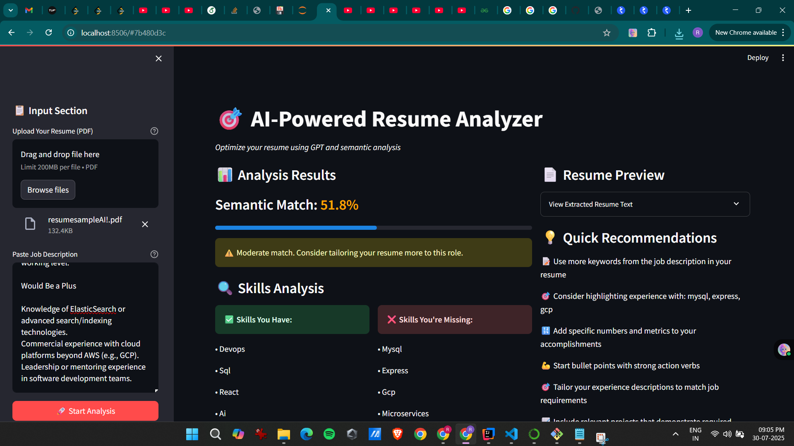
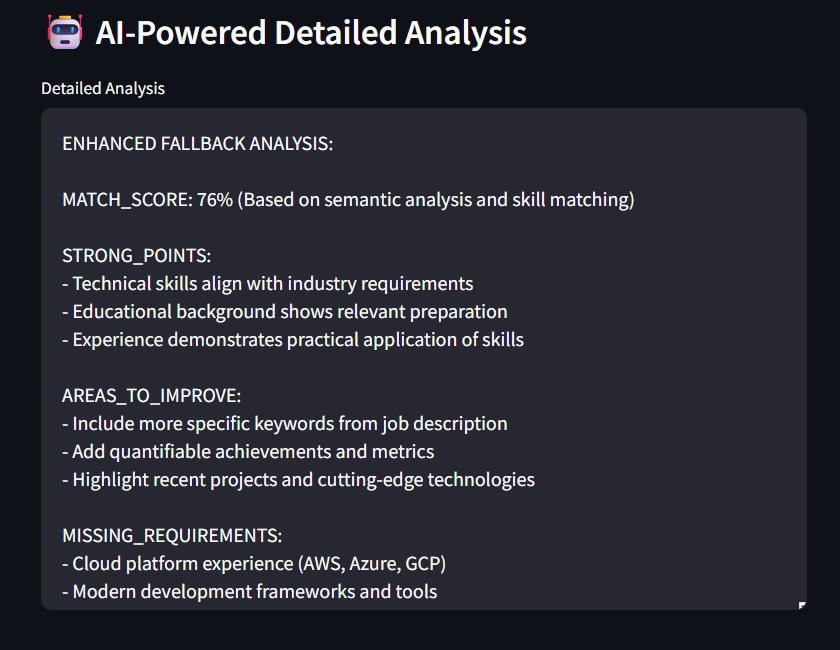

🎯 AI-Powered Resume Analyzer
An intelligent resume analysis tool that leverages GPT-3.5 and semantic similarity to help job seekers optimize their resumes for specific job postings. Get detailed insights, skill gap analysis, and personalized recommendations to improve your chances of landing your dream job.

✨ Features

Smart PDF Processing: Extracts text from resume PDFs using multiple parsing methods for maximum reliability
Semantic Similarity Analysis: Uses advanced sentence transformers to calculate how well your resume matches job descriptions
AI-Powered Insights: GPT-3.5 integration provides detailed analysis and personalized recommendations
Skills Gap Analysis: Automatically identifies matching and missing technical skills
Interactive Web Interface: Clean, user-friendly Streamlit interface with real-time analysis
Export Functionality: Download comprehensive analysis reports
Fallback Analysis: Works even without OpenAI API key using advanced semantic matching

🚀 Demo

Upload your resume, paste a job description, and get instant AI-powered insights!

🛠️ Technologies Used

Frontend: Streamlit
AI/ML: OpenAI GPT-3.5, Sentence Transformers (all-MiniLM-L6-v2)
PDF Processing: PyMuPDF, pdfplumber
Data Processing: Pandas, NumPy, Scikit-learn
Similarity Computation: Cosine similarity with embeddings
Environment Management: python-dotenv

📋 Prerequisites

Python 3.8 or higher
OpenAI API key (optional but recommended for enhanced analysis)

🔧 Installation

Clone the repository:
bashgit clone https://github.com/yourusername/ai-resume-analyzer.git
cd ai-resume-analyzer

Create a virtual environment:
bashpython -m venv venv
source venv/bin/activate  # On Windows: venv\Scripts\activate

Install dependencies:
bashpip install -r requirements.txt

Set up environment variables (optional):
bashcp .env.example .env
Add your OpenAI API key to the .env file:
OPENAI_API_KEY=your_openai_api_key_here

🎮 Usage
Running Locally

Start the Streamlit app:
bashstreamlit run app.py

Open your browser and navigate to http://localhost:8501
Use the application:

Upload your resume (PDF format) in the sidebar
Paste the job description you're targeting
Optionally add your OpenAI API key for enhanced analysis
Click "Start Analysis" to get insights

Features Walkthrough

Semantic Analysis: Get a percentage match between your resume and job description
Skills Analysis: See which technical skills you have and which you're missing
AI Recommendations: Receive detailed feedback on how to improve your resume
Export Report: Download a comprehensive analysis report

📁 Project Structure
ai-resume-analyzer/
├── app.py                 # Main Streamlit application
├── requirements.txt       # Python dependencies
├── .env.example          # Environment variables template
├── README.md             # Project documentation
├── .gitignore           # Git ignore file
└── assets/              # Screenshots and demo files
    └── demo-screenshot.png
    
🔑 Environment Variables
Create a .env file with the following variables:
bashOPENAI_API_KEY=your_openai_api_key_here  # Optional but recommended

🔮 Future Enhancements

 Support for multiple resume formats (Word, TXT)
 ATS (Applicant Tracking System) optimization score
 Resume template suggestions
 Industry-specific skill databases
 Batch analysis for multiple job postings
 Integration with job boards APIs
 Resume builder with AI suggestions

🐛 Known Issues

Large PDF files (>10MB) may take longer to process
Complex PDF layouts might affect text extraction accuracy
OpenAI API rate limits may apply for heavy usage
